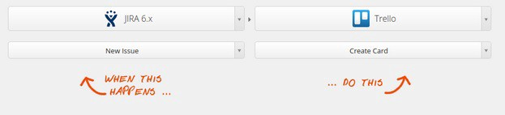
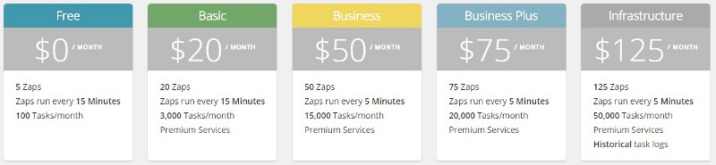
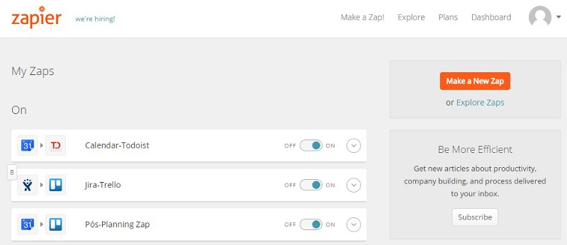
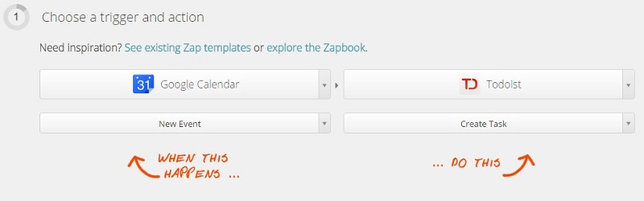
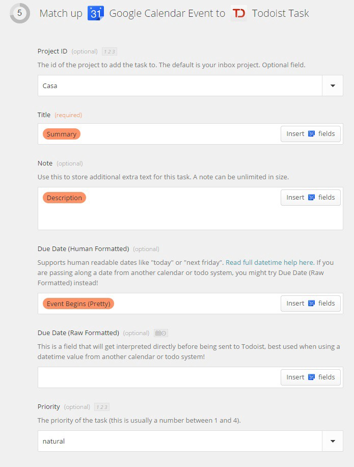
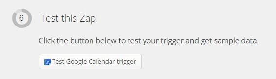
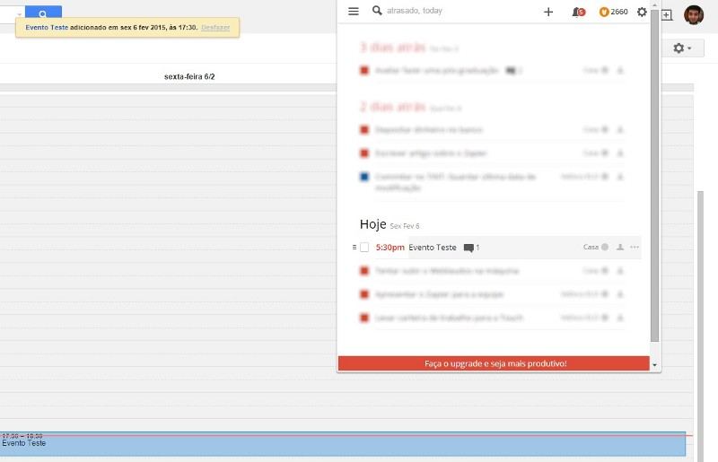

|Data|Publicação|
|-----|-------|
|4 de janeiro de 2016|Medium (https://medium.com/@DiegoMartinsDePinho/zapier-automatize-as-suas-tarefas-9924b994fc2d#.v3tjgv27k)|
|13 de fevereiro de 2015|Profissionais TI (https://www.profissionaisti.com.br/2015/02/automatize-suas-tarefas-com-o-zapier/)|

# Zapier — Automatize as suas tarefas

Todo bom desenvolvedor cultiva um “hábito saudável”: o de ser preguiçoso. O desenvolvedor não quer perder tempo com tarefas burocráticas e manuais, como por exemplo, escrever uma documentação de API, um release notes, etc. O que ele faz? Ele consegue uma maneira de automatizar o processo e criar tudo isso de forma automática.

Quando estamos trabalhando em um projeto de desenvolvimento, somos muitas vezes obrigados a utilizar muitas ferramentas diferentes, cada uma com um propósito, vantagens e desvantagens. Eu, por exemplo, lido diariamente com muitas ferramentas: Trello (gerenciamento de tarefas), Jira (gestão de projetos), Confluence (wiki), Google Calendar (agenda), e assim por diante.

Muitas destas ferramentas conversam de maneira “indireta” umas com as outras, ou seja, manualmente eu associo suas informações para que fiquem consistentes com o contexto geral do projeto. Um bom exemplo é o gerenciamento de issues. Para cada issue criada no Jira, eu preciso criar um card no Trello para que a minha equipe possa trabalhar com ela dentro do sprint. Ou então, associar um evento da minha agenda com uma issue do meu projeto.

Todo esse trabalho manual costuma ser chato e trabalhoso de se fazer e, principalmente, gasta muito tempo, tempo que poderia ser ocupado com codificação e resolução de problemas. Para ajudar a solucionar este empecilho que existe a ferramenta Zapier.

O Zapier é um serviço web que possibilita integrar aplicações. Ele funciona de maneira muito simples: Você configura um “Zap” que associa uma trigger a uma ação. A trigger e a ação podem ser do mesmo aplicativo ou entre dois aplicativos diferentes.

Para entender como a ferramenta funciona, vamos criar um “Zap” com as ferramentas: ToDoist (gerenciador de lista de tarefas) e o Google Calendar (agenda). Sempre que eu criar um evento no meu calendário, eu quero que ele automaticamente crie uma tarefa no meu ToDoist, como por exemplo: “Jantar na casa da Joana — Ter 22/10 às 20h”.

Primeiramente é necessário criar uma conta no Zapier. Existem 5 tipos de planos diferentes. Vamos criar uma conta Free.

Uma vez que você tenha feito sua conta, você será redirecionado para sua Dashboard. A partir dai vamos em “Make a new Zap”.

Nesta tela agora deveremos escolher qual aplicativo e sua ação correspondente acionará uma ação em outro (não necessariamente) aplicativo. No nosso exemplo, queremos que toda vez que eu crie um evento na minha agenda, ele crie um tarefa no meu gerenciador de tarefas. Então ficará assim:

Para cada serviço que você quiser automatizar com o Zapier você deverá autorizar o acesso a sua conta, caso contrário, não será possível integrar os serviços. Feito isso, está na hora de configurar. Obviamente que para cada serviço diferente haverá configurações diferentes. Para o nosso caso, deveremos:

* Selecionar a agenda
* Adicionar filtros (opcional): Caso você não adicione nenhum filtro nos seus eventos, todos eles resultarão em tarefas no gerenciador de tarefas
* Configurar: Título, descrição, data e prioridade

Vale constar que na configuração podemos utilizar campos automáticos, ou seja, é possível recuperar dados da aplicação trigger para configurar a aplicação ação. Para nós, o título, descrição e data serão dados que iremos recuperar do evento no Google Calendar. Vale reforçar que para cada serviço diferentes, iremos ter campos de configuração e campos automáticos diferentes.

Agora que configuramos o nosso “Zap”, o Zapier vai nos dar a oportunidade de testá-lo. Basta clicar no botão “Test Google Calendar trigger” e seguir os passos:
* Logar no Google Calendar
* Criar um evento
* Ativar busca manual
* Pronto!

Se tudo der certo, o Zapier irá criar a tarefa no ToDoist com os dados do evento que inserimos no Google Calendar.

Pronto! Você automatizou a sua primeira tarefa! Legal, né? Agora a imaginação é o limite… brinque com as aplicações e possibilidades e automatize suas tarefas para aumentar a sua criatividade! O Zapier dá suporte a uma grande variedade de ferramentas consagradas, tais como: GitHub, BitBucket, Jenkins, Dropbox, Evernote, Wordpress, entre outros.

E um viva à preguiça!
